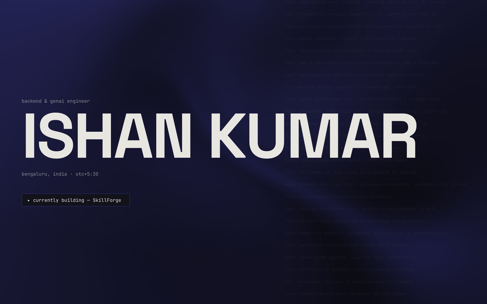

# ishan-portfolio

Cinematic, scroll-driven portfolio for Ishan Kumar (Backend & GenAI Engineer).
Built on the brief in [`handoff/`](./handoff) — read `docs/PRD.md`,
`DESIGN-SPEC.md`, and `CONTENT.md` before changing structure or copy.

**Live:** [ishan-kumar.netlify.app](https://ishan-kumar.netlify.app/) — click the preview to open it.

[](https://ishan-kumar.netlify.app/)

## Stack

- **Next.js 16** (App Router) + **React 19.2** + **TypeScript**
- **Tailwind v4** — tokens live only in `globals.css` / `@theme` (never inline hex)
- **Motion 12** + **Lenis** for choreography; **Paper Shaders** for the desktop hero glow
- Native **View Transitions** for route changes
- `zod`-typed content in `src/content/`
- Live `now.log` parsed from the GitHub profile README via ISR (hourly)

## Develop

```bash
npm install
npm run dev          # http://localhost:3000
npm run build        # production build (all routes SSG/ISR)
npm run lint
npm test             # vitest — now.log parser contract test
```

## Structure

```
src/
  app/            routes: / · /work · /work/[slug] · /lab · /now · /now.json
                  + sitemap · robots · opengraph-image · icon
  components/     one folder per section (hero, message, strip, worlds, hall,
                  marquee, nowlog, footer) + ui/ (Nav, Reveal, Schematic, JsonLd)
  content/        zod schemas + typed data from handoff/docs/CONTENT.md
  lib/            nowlog.ts (fetch+parse) · choreo.ts (motion grammar)
notes/DECISION-LOG.md   resolved decisions (append-only)
```

## Conventions & guardrails

- All copy comes from `handoff/docs/CONTENT.md`; claims stay inside its facts registry.
- Every scroll choreography goes through `useChoreo()` so the reduced-motion
  branch is in one place. Content is visible without JS and under reduced motion.
- Phosphor green (`--phosphor`) is quarantined to terminal panes (the now.log
  pane). The site's voice is electric indigo (`--volt`); `--volt-bright` is the
  AA-safe variant for small accent text.
- Quality bar (verified mobile Lighthouse): Perf 90 · A11y 100 · BP 100 · SEO 100.
- **Back/forward scroll memory** — Lenis drives scrolling, which defeats native
  scroll restoration. `components/providers/ScrollRestoration.tsx` (mounted inside
  `SmoothScroll`) takes manual control, remembers the last scroll offset per route
  in `sessionStorage` (bounded LRU), and restores it on a real Back/Forward or a
  reload — via `lenis.scrollTo(..., { immediate })`, or `window.scrollTo` under
  reduced motion. Forward link clicks still land at the top; renders `null` (no-JS
  safe). See `notes/DECISION-LOG.md` (2026-06-14).

## Deploy (Netlify)

Connect this repo on Netlify — it auto-detects Next.js and installs
`@netlify/plugin-nextjs`, which keeps ISR (the hourly `now.log`) and the edge
OG/favicon routes working. **No static export, no `netlify.toml`, no manual
publish dir.** Build command is `npm run build`; everything else (content, fonts,
`resume.pdf`) is bundled — the only runtime dependency is GitHub's public README
for `now.log`, which falls back to `src/content/nowlog.fallback.json` if offline.

> `SITE_URL` in `src/content/site.ts` only feeds SEO/social metadata (OpenGraph,
> sitemap, robots, JSON-LD). It does **not** affect the build — point it at the
> live host. Buying a domain later? Change that one line and redeploy.

## Owner TODO before launch

- Replace `public/resume.pdf` on each résumé version bump.
- Supply real Strip screenshots (TicketFlow logs, htop/agent-box, AI_Bubble,
  campus) — they currently render as SVG schematics; see `src/content/strip.ts`.
- Provide the Hashnode URL (omitted — not in any source doc; see footer/lab TODOs).
- D7: buy domain, set `SITE_URL` in `src/content/site.ts`, 301 the old Netlify URL.
